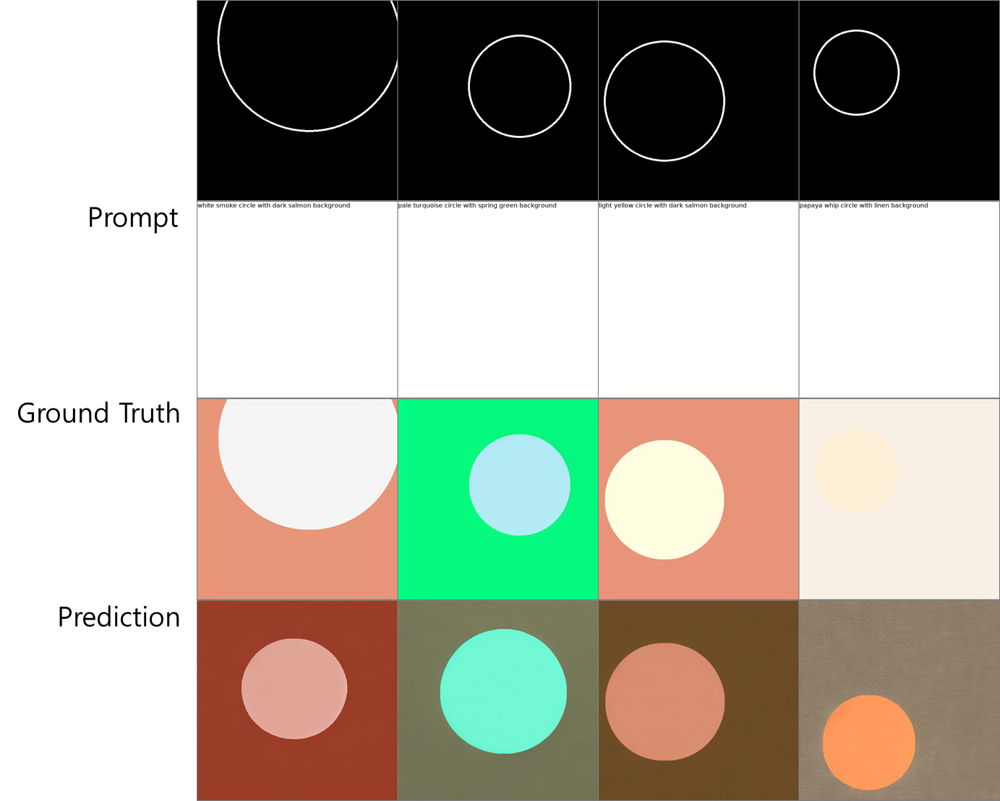

# Stable Diffusion + ControlNet

By repeating the above simple structure 14 times, we can control stable diffusion in this way:

In this way, the ControlNet can **reuse** the SD encoder as a **deep, strong, robust, and powerful backbone** to learn diverse controls. Many evidences (like [this](https://jerryxu.net/ODISE/) and [this](https://vpd.ivg-research.xyz/)) validate that the SD encoder is an excellent backbone.

Note that the way we connect layers is computational efficient. The original SD encoder does not need to store gradients (the locked original SD Encoder Block 1234 and Middle). The required GPU memory is not much larger than original SD, although many layers are added. Great!

# Setting environment

First create a new conda environment

    conda env create -f environment.yaml
    conda activate control

# Finetuning

## Step 1 - dataset ( custom dataset )
Just download the Fill50K dataset from [our huggingface page](https://huggingface.co/lllyasviel/ControlNet) (training/fill50k.zip, the file is only 200M!). Make sure that the data is decompressed as 

    ControlNet/training/fill50k/prompt.json
    ControlNet/training/fill50k/source/X.png
    ControlNet/training/fill50k/target/X.png
    
In the folder "fill50k/source", you will have 50k images of circle lines.

## Step 2 - Load the dataset
Then you need to write a simple script to read this dataset for pytorch. (In fact we have written it for you in "tutorial_dataset.py".)         
Prepare the dataset as a PyTorch Dataset class so that it can be used for training in batch units. Modify the data path to your own directory.

    python tutorial_dataset.py

## Step 3 - Create the ControlNet Model
Then you need to decide which Stable Diffusion Model you want to control. In this example, we will just use standard SD1.5. You can download it from the [official page of Stability](https://huggingface.co/runwayml/stable-diffusion-v1-5/tree/main). You want the file ["v1-5-pruned.ckpt"](https://huggingface.co/runwayml/stable-diffusion-v1-5/tree/main).

(Or ["v2-1_512-ema-pruned.ckpt"](https://huggingface.co/stabilityai/stable-diffusion-2-1-base/tree/main) if you are using SD2.)
- Objective   
Select which version of Stable Diffusion to extend with ControlNet,
and create a new .ckpt file by attaching the ControlNet architecture to the existing SD model.

- How it works      
Run tool_add_control.py:
Load the original SD checkpoint (e.g., v1-5-pruned.ckpt).   
Construct the ControlNet architecture by duplicating the SD encoder and adding Zero Convolution layers.   
Copy the SD weights into the corresponding ControlNet structure.  
Save the new .ckpt (e.g., control_sd15_ini.ckpt).

We provide a simple script for you to achieve this easily. If your SD filename is "./models/v1-5-pruned.ckpt" and you want the script to save the processed model (SD+ControlNet) at location "./models/control_sd15_ini.ckpt", you can just run:

    python tool_add_control.py ./models/v1-5-pruned.ckpt ./models/control_sd15_ini.ckpt

Or if you are using SD2:

    python tool_add_control_sd21.py ./models/v2-1_512-ema-pruned.ckpt ./models/control_sd21_ini.ckpt

## Step 4 - Train
The training code in "tutorial_train.py" is actually surprisingly simple. (or "tutorial_train_sd21.py" if you are using SD2)          
Train the model using the prepared dataset and the .ckpt that includes the ControlNet structure, so that it learns to reconstruct the target image given the condition (hint) and the prompt.

    python tutorial_train.py
      
Or if you are using SD2:

    python tutorial_train_sd21.py

## Step 4 - Conclusion    
Below is the result obtained after training for 3 epochs with a batch size of 2 on an NVIDIA GeForce RTX 3090      
Although the output does not perfectly match the given condition, the original generative capability of Stable Diffusion is preserved. However, achieving perfect condition adherence is likely to require longer training time    

# Inference

All models and detectors can be downloaded from [our Hugging Face page](https://huggingface.co/lllyasviel/ControlNet). Make sure that SD models are put in "ControlNet/models" and detectors are put in "ControlNet/annotator/ckpts". Make sure that you download all necessary pretrained weights and detector models from that Hugging Face page, including HED edge detection model, Midas depth estimation model, Openpose, and so on. 

We provide 9 Gradio apps with these models.

All test images can be found at the folder "test_imgs".   

Stable Diffusion 1.5 + ControlNet (using simple Canny edge detection)

    python gradio_canny2image.py

Stable Diffusion 1.5 + ControlNet (using simple M-LSD straight line detection)

    python gradio_hough2image.py

Stable Diffusion 1.5 + ControlNet (using Scribbles)

    python gradio_scribble2image.py

Stable Diffusion 1.5 + ControlNet (using human pose)

    python gradio_pose2image.py

Stable Diffusion 1.5 + ControlNet (using semantic segmentation)

    python gradio_seg2image.py

Stable Diffusion 1.5 + ControlNet (using depth map)

    python gradio_depth2image.py

Prompt: "Stormtrooper's lecture"

# Citation

    @misc{zhang2023adding,
      title={Adding Conditional Control to Text-to-Image Diffusion Models}, 
      author={Lvmin Zhang and Anyi Rao and Maneesh Agrawala},
      booktitle={IEEE International Conference on Computer Vision (ICCV)}
      year={2023},
    }

[Arxiv Link](https://arxiv.org/abs/2302.05543)

[Supplementary Materials](https://lllyasviel.github.io/misc/202309/cnet_supp.pdf)
